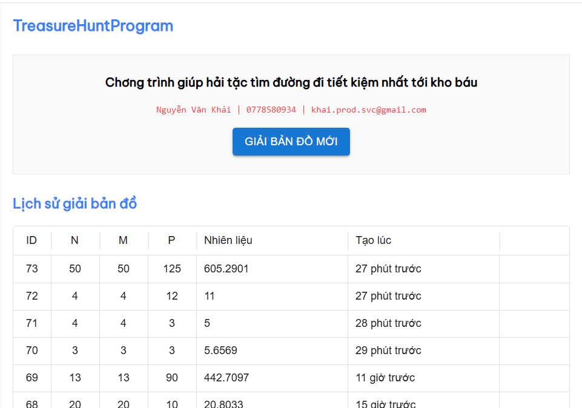

# Chương trình Tìm Kho Báu (TreasureHuntProgram)


## Tổng quan
Đây là Project cho bài test "Tìm kho báu" vị trí Full stack Developer.

## Thông tin người thực hiện
- **Họ và tên:** Nguyễn Văn Khải
- **Email:** khai.prod.svc@gmail.com

## Demo và Repository
- **Demo trực tuyến:** [http://treasurehunt.aclould.vn](http://treasurehunt.aclould.vn)
- **GitHub Repository:** [https://github.com/nvkhai603/interview-test](https://github.com/nvkhai603/interview-test)

## Các bước xử lý bài toán
1. **Phân tích bài toán**
- Tìm đường đi ngắn nhất

2. **Code API xử lý bài toán**
- Triển khai thuật toán tìm đường đi ngắn nhất Dijkstra
- Lưu kết quả vào database bằng EntityFramework và SQLite

3. **Code giao diện**
- Lên giao diện cơ bản
- Xử lý Grid cho nhập ma trận tối đa 500 hàng 500 cột đảm bảo Performance

4. **Triển khai tính năng bổ sung**
- Thêm các tính năng tiện ích bổ sung
- Triển khai hệ thống

5. **Kiểm tra tổng quát**
- Kiểm tra và xác minh toàn bộ hệ thống

## Cấu trúc Project
- **Frontend (`treasure-hunt-client`)**
- ReactJs
- Material-UI (MUI)
- TailwindCSS

- **Backend (`treasure-hunt-server`)**
- .NET 8
- Entity Framework
- SQLite

## Hướng dẫn cài đặt và chạy Project

### Yêu cầu hệ thống
- .NET 8 SDK
- Node.js 18 trở lên

### Các bước cài đặt

1. **Clone Project**
```bash
git clone https://github.com/nvkhai603/interview-test
```

2. **Cài đặt và chạy Frontend**
```bash
cd interview-test/treasure-hunt-client
npm install
npm run dev
```
Frontend sẽ chạy tại địa chỉ: http://localhost:5173

3. **Cài đặt và chạy Backend**
- Mở Visual Studio
- Mở solution từ đường dẫn `interview-test/treasure-hunt-client/treasure-hunt-server.sln`
- Nhấn F5 để chạy backend API

4. **Truy cập ứng dụng**
- Mở trình duyệt và truy cập địa chỉ http://localhost:5173